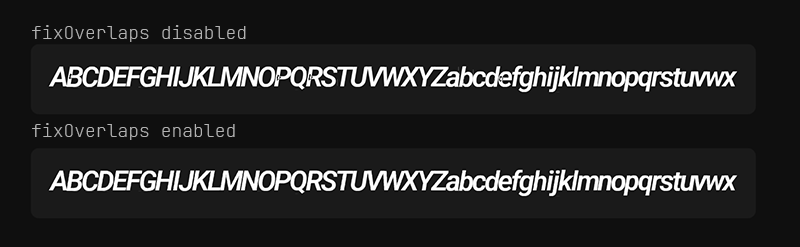

# @zappar/msdf-generator

A WebAssembly port of [msdfgen](https://github.com/Chlumsky/msdfgen) for generating high-quality multi-channel signed distance field (MSDF) font atlases directly in the browser.

## What is MSDF?

Multi-channel signed distance fields (MSDF) use all three color channels (RGB) to encode distance information, allowing sharp corners and fine details to be preserved much better than traditional single-channel signed distance fields. This makes them ideal for high-quality text rendering at any scale.

## Live Demo

Try it out at [msdf.zap.works](https://msdf.zap.works)

## Installation

```bash
npm install @zappar/msdf-generator
```

## Usage

```typescript
import {MSDF} from '@zappar/msdf-generator';

// Create instance (auto-detects worker/WASM paths)
const msdf = new MSDF();

// Initialize (loads worker and WASM)
await msdf.initialize();

// Load your font file
const req = await fetch('./Inter_28pt-Thin.ttf');
const ab = await req.arrayBuffer();
const fontBuffer = new Uint8Array(ab);

// Generate MSDF atlas
const result = await msdf.generate({
  font: fontBuffer, // Font file data (required)
  charset: 'ABCDEFGHIJKLMNOPQRSTUVWXYZabcdefghijklmnopqrstuvwxyz0123456789', // Characters to include (required)
  fontSize: 48, // Glyph rasterization resolution (higher = more detail in atlas)
  textureSize: [512, 512], // Atlas container dimensions [width, height] for packing all glyphs
  fieldRange: 4, // Max encoded distance in pixels (higher = smoother, lower = sharper/more precise)
  fixOverlaps: true, // Fix overlapping contours in glyphs (B, P, R, etc.)
  onProgress: (progress, completed, total) => {
    console.log(`${progress}%`);
  },
});

// result contains the font family data ready for @pmndrs/uikit:
// { 'Inter 28pt Thin': { 250: { pages, chars, info, common, distanceField, kernings } } }

// Clean up when done
await msdf.dispose();
```

### Multiple Fonts

Generate multiple fonts sequentially:

```typescript
const result = await msdf.generate({
  fonts: [
    {font: robotoRegular},
    {font: robotoBold, fixOverlaps: true},
    {font: openSans, fontSize: 64, textureSize: [1024, 1024]},
  ],
  charset: 'ABCabc123',
  fontSize: 48,
  onProgress: (progress, completed, total) => {
    console.log(`${progress}% (${completed}/${total})`);
  },
});

// Returns merged FontFamily
```

### @react-three/uikit

To use with `@react-three/uikit`, simply pass the `result` into the `fontFamilies` prop.

```tsx
<Canvas>
  <Container fontFamilies={result}>
    <Text fontFamily="Inter 28pt Thin" fontWeight={400}>
      Hello World
    </Text>
  </Container>
</Canvas>
```

## Overlap Fixing

The `fixOverlaps` option fixes overlapping contours in glyphs like B, P, R, etc. This comparison shows the difference:



## Bundler Setup

### Advanced Usage (Custom WASM/Worker URLs)

You can override the default paths:

```typescript
import {MSDF} from '@zappar/msdf-generator';
import workerUrl from '@zappar/msdf-generator/worker.js?worker&url';
import wasmUrl from '@zappar/msdf-generator/msdfgen_wasm.wasm?url';

const msdf = new MSDF({
  workerUrl,
  wasmUrl:,
});
```

## Licenses

This package is MIT Licensed. However, it bundles the following third-party components, each with its own license:

- [msdfgen](https://github.com/Chlumsky/msdfgen/blob/master/LICENSE.txt) - MIT License
- [stb_truetype](https://github.com/nothings/stb/blob/master/LICENSE) - Public Domain (MIT Licensed)
- [Skia PathOps](https://github.com/google/skia/blob/main/LICENSE) - BSD 3-Clause License
